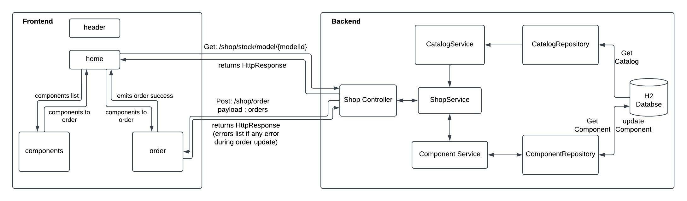
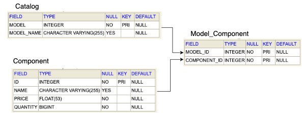

# Design

## High Level Design

  

The development involve:

- Angular 9
- Java (17) Spring Boot 3
- H2 Database (In memory database used just for development)

## Design

  

The image above provides the complete overview of the development. The frontend components and backend classes are specified.

### Frontend Components

- `header` - Used to display the header
- `home` - Home page of the app. It has an input field which takes `model_id` as input and a search button is provided to send a request to the backend. On clicking search button, `GET` request is made to the backend. The backend request the process and sends the `HttpResponse`. 

    - Response 200 - components is successfully fetched and is sent to `component`.
    - Response 404 - components not found for the `model_id` and a message is displayed.
    - Response 500 - Nothing is shown (should show error or message but couldn't complete because of time constraints)

- `component` - shows the list of components in a card with dummy image. Each card will have option to select quantity and a button to add it to the cart for ordering. Upon selecting the quantity, the `Add to Cart` button will be enabled and on clicking the button, the ordered component will be sent to `home`. The `home` will then send it to the `order`.
- `order` - shows the components that are added. The `Order` button is provided here which can be used to place the order. On clicking `Order` button, a `POST` request with the orders payload will be made and the request will return the `HttpResponse`.
    - Response 200 - Response is 200 as we are updating the component and not creating it. On successful order, order success message is displayed.
    - Response 400 - Error placing the order. While placing the order, if quantity is not sufficient in inventory or component_id is not found, then error will be thrown. These errors come as list of string which are displayed.
    - Response 500 - Nothing is shown (should show error or message but couldn't complete because of time constraints)

### Backend Classes

- `ShopController` - Main controller which provides to endpoint API. The API's receives requests from client and sends HttpResponse.
- `Services` - Three services are provided.
    
    - `CatalogService` - It gets the required catalog based on the `model_id` and communicates with `CatalogRepository`.
    - `ComponentService` - It gets the required component based on the `component_id` and also updates the quantity of the component. It communicates with `ComponentRepository`.
    - `ShopService` - It uses other two services to get and updates the components and catalog.

- `Repository` - Two repositories are provided which communicates with the database to fetch and update.

## Database schema

Database has three tables as shown below.

  

